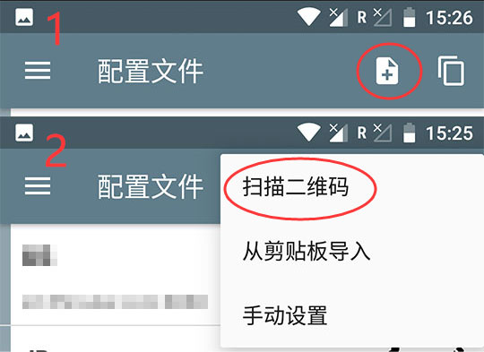
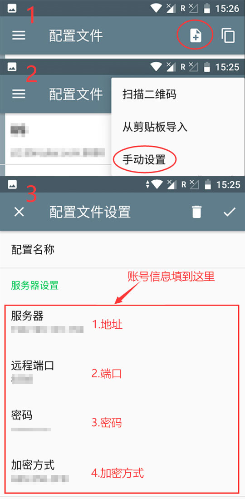
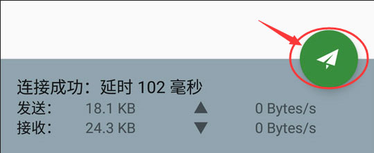

# Android教程

## 1.下载软件.

下载并运行Android下的软件。（请从本站链接下载软件）


[**本地下载**](https://dl.nordss.com/last_andriod.apk)   **/**   [**Github下载**](https://github.com/shadowsocks/shadowsocks-android/releases/download/v4.6.5/shadowsocks--universal-4.6.5.apk)


## 2.获取账号信息.

注册登陆 **​**[**『用户中心』**](https://user.fkwall.com)​ ，选择 **『账号』** ，获取账号信息。


账号信息包括： 1.地址，2.端口，3.密码，4.加密方式


## 3.配置软件.

运行软件，点击左上角的 **『 + 』** ，选择 **『扫描二维码』** ，扫描上一步中的二维码完成添加。

**或者**，点击左上角的 **『 + 』**，选择 **『手动设置』** ，填入信息，点击左上角的 **『 √ 』**确认。

## 4.启用代理.

选择刚才添加的服务器，点击右下角的小飞机，开始上网。

## 联系我们   


邮箱：[five5mu@gmail.com](mailto:five5mu@gmail.com)​


