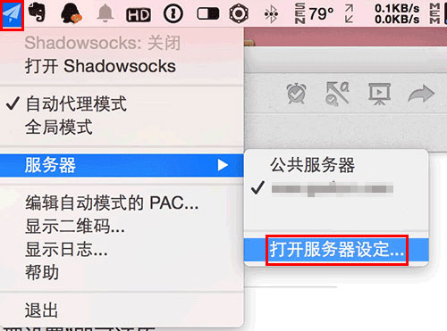
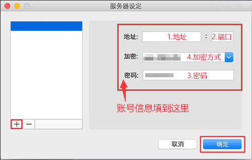
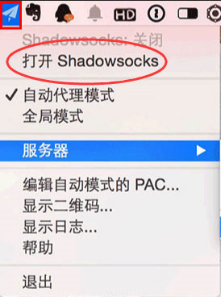

# MacOS教程

## 1.下载软件.

下载并运行MacOS下的软件。（请从本站链接下载软件）


[**本地下载**](https://dl.nordss.com/last_macos.zip)   **/**   [**Github下载**](https://github.com/shadowsocks/ShadowsocksX-NG/releases/download/v1.8.2/ShadowsocksX-NG.app.1.8.2.zip)


## 2.获取账号信息.

注册登陆 **​**[**『用户中心』**](https://my.d7networks.xyz/)**​** ，选择 **『账号』** ，获取账号信息。


账号信息包括： 1.地址，2.端口，3.密码，4.加密方式


## 3.配置软件.

右键任务栏里的角标，选择 **『打开服务器设定』** ，将账号信息添加到软件。

## 4.启用代理.

右键任务栏里的角标，选择 **『打开Shadowsocks』** ，开启代理。

