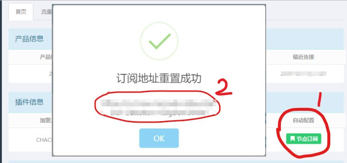

# SSR IOS

## 1.在APPSTORE 搜索相关客户端, 并下载安装.


支持ss协议的IOS软件有：**Shadowrocket**、Surge等。

**推荐下载：Shadowrocket**

目前中国区APPSTORE均已经下架。  
最好的解决方式是注册美国或者香港的APPSTORE账号，  
过程其实很简单，只需要在选择区域的时候选择美国或者香港即可。


## 2.获取订阅地址.

访问 [**『用户中心』**](https://ss.5mu.me/)**，**购买服务 **，**选择 **『我的服务』-『管理产品』** ，复制订阅地址。

## 3.配置软件.



點擊圖標啟動 Shadowrocket；

點擊屏幕中部「添加節點」選單，或者也可以點擊右上角的「加號圖標」；

點擊屏幕上部的「類型」選單；

點擊選擇「Subscribe」；

粘貼第 2 步複製的訂閱網址進「URL」欄；

在「備註」欄位中給這個訂閱起個名字；

點擊屏幕右上角「完成」退出新增訂閱；

客戶端 App 會自動嘗試從新增的訂閱地址同步節點信息；

將右上角鏈接開關滑動到右邊，開啟 VPN 。


在「服務器訂閱」組下的節點訂閱條目上左滑可叫出條目菜單，點擊「更新」可手動觸發節點同步。

將 VPN 開關撥動到開啟位置後，點擊右下角「數據圖標」，屏幕中部會顯示本次連接流量計數。紅色箭頭標示上傳數字，綠色箭頭標示下傳數字。如只見上傳數字增長，而下傳數字始終不變，則表明節點連不上。

節點連不上時可嘗試切換不同節點。


