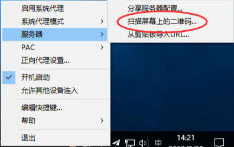

# SSR for Windows

## 1.下载软件.

下载并运行SSR for Windows（请从本站链接下载软件）


[**本地下载**](http://dl.nordss.com/last_windows.zip)   **/**   [**Github下载**](https://github.com/shadowsocks/shadowsocks-windows/releases/download/4.1.2/Shadowsocks-4.1.2.zip)



注意：如果下载解压后无法运行，提示 "应用程序正常初始化失败" ，说明系统缺少.net framework ，请先安装 [\[.NET Framework\]](https://go.microsoft.com/fwlink/?LinkID=863265)


## 2.获取订阅地址.

注册登陆 [**『用户中心』**](https://user.fkwall.com) **，**选择 **『我的服务』-『管理产品』** ，获取订阅地址。

## 3.配置软件.

运行软件，双击右下角的角标，将账号信息依次填入软件，然后点击**『确定』。**

**或者**，通过扫描上一步中的二维码也可迅速添加账号到软件。

## **4.启用代理.**

右键右下角的角标，勾选 **『启用系统代理』** ，开始上网**。**


建议将所有服务器都添加到软件，根据自身需求选择最快的节点。也可开启软件的 "高可用" 或 "负载均衡" 模式智能切换。



PAC模式的优点是境外服务走代理，境内服务不走代理。缺点是有时判断不准确，造成某些服务打不开，这时候切换至全局模式即可。


## 联系我们


邮箱：[five5mu@gmail.com](mailto:five5mu@gmail.com)​


