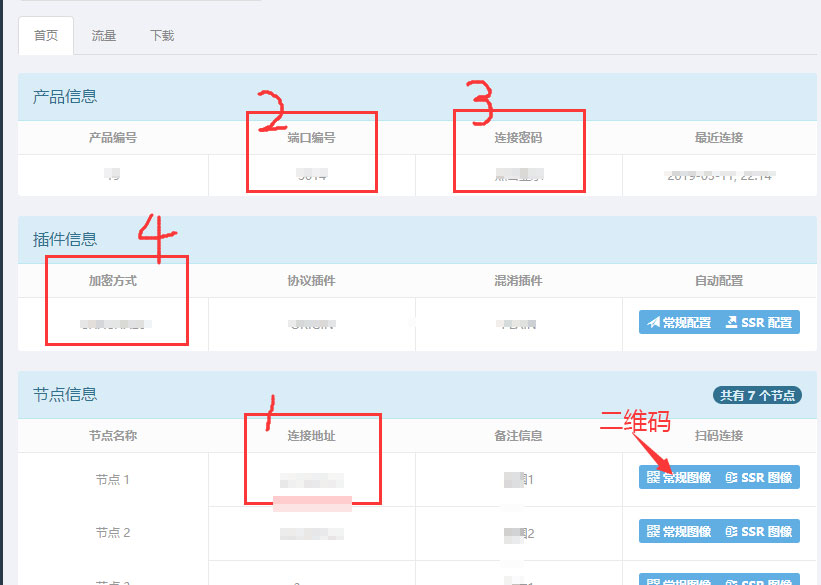
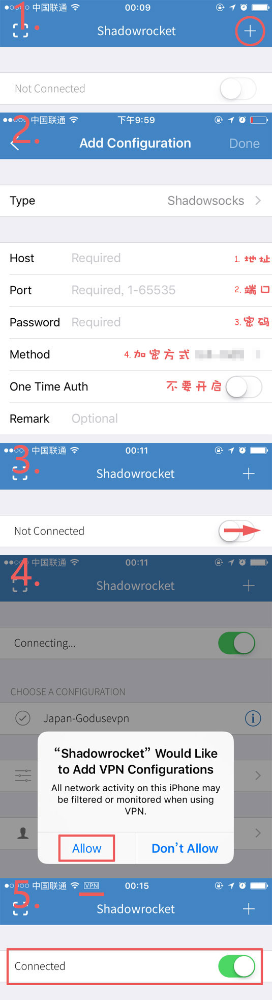

# IOS教程

## 1.在APPSTORE 搜索相关客户端, 并下载安装.


支持ss协议的IOS软件有：**Shadowrocket**、Surge等。

**推荐下载：Shadowrocket**

目前中国区APPSTORE均已经下架。  
最好的解决方式是注册美国或者香港的APPSTORE账号，  
过程其实很简单，只需要在选择区域的时候选择美国或者香港即可。


## 2.获取账户信息.

注册登陆 **​**[**『用户中心』**](https://user.fkwall.com)**​** ，选择 **『账号』** ，获取账号信息。


账号信息包括： 1.地址，2.端口，3.密码，4.加密方式


## 3.配置软件.


以下教程以**Shadowrocket**为例图解配置步骤。


## 联系我们   


邮箱：[five5mu@gmail.com](mailto:five5mu@gmail.com)​


